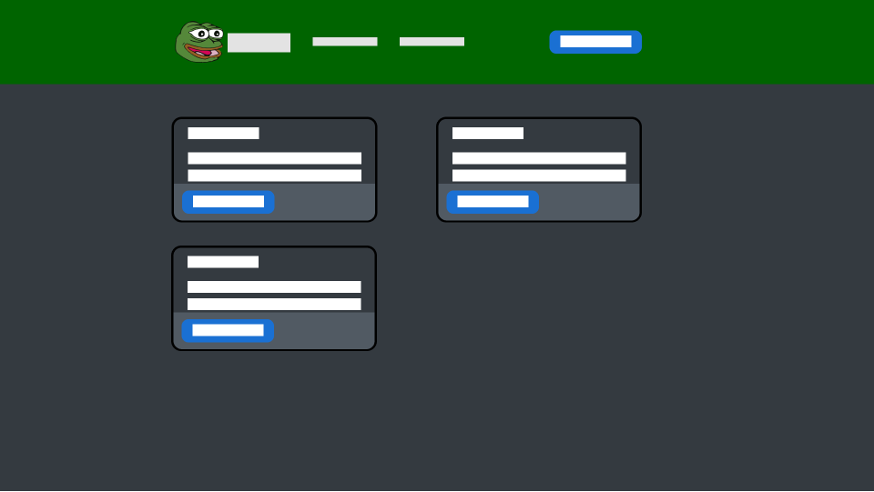
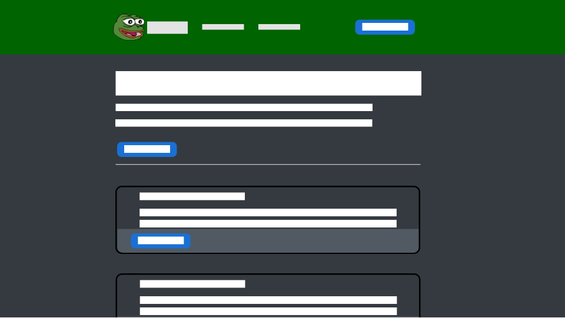
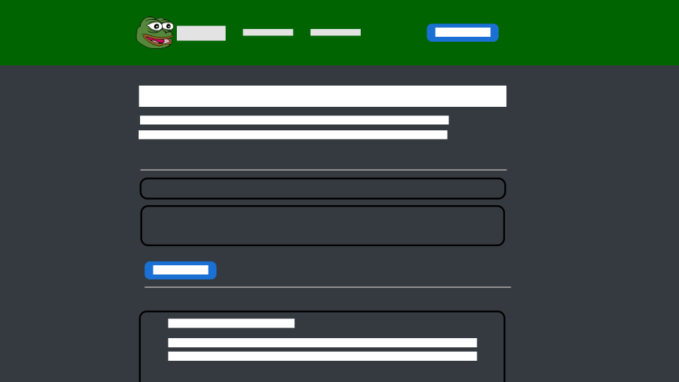

= Objects

[plantuml]
----
@startuml

class Post {
    id: int
    title: string
    content: string
    author: string
    createdDate: Date
    category: int
    likes: int
    dislikes: int
}

class Comment {
    id: int
    content: string
    author: string
    post: int
    createdDate: Date
    likes: int
    dislikes: int
}

class Category {
    id: int
    name: string
    description: string
}

Post -- Category

Post --  Comment

@enduml
----

== Use cases

.Usecase diagramm von dem Messageboard
[plantuml]
----
@startuml

left to right direction

rectangle MessageBoard {
    usecase "Post erstellen" as UC1
    usecase "Post Kommentieren" as UC2
    usecase "Post bearbeiten" as UC3
    usecase "Post löschen" as UC4
}

user --> UC1
user --> UC2
user --> UC3
user --> UC4

@enduml
----

=== UC1 Post erstellen

Ich will unter einem beliebigen Namen einen Post erstellen.

[plantuml]
----
@startuml

actor user

user -> backend : POST /posts
user <- backend : 201 Post
@enduml
----

=== UC2 Post Kommentieren

Ich will unter einem Post unter einem beliebigen Namen einen Kommentar erstellen.

[plantuml]
----
@startuml

actor user

user -> backend : POST /posts/{postId}/comments
user <- backend : 201 Comment
@enduml
----

== UC3 Kategorie erstellen

Ich will eine neue Kategorie erstellen können.

[plantuml]
----
@startuml

actor user

user -> backend : POST /posts
user <- backend : 201 Post
@enduml
----

Vom user kann eine neue Kategorie erstellt werden.

== Test cases

=== TC1 Standardkategorien abrufen

|===
|Typ | Beschreibung

|Beschreibung
|Nach einem Restart wird getestet, welche Kategorien bereits vorhanden sind.

|Vorbedingungen
|Backend vorhanden

|Steps
|1. Backend neustarten

2. Auf den endpoint `/categories` gehen

3. Die Ergebnis vergleichen

|Ergebnis
|Die Kategorie "Rick Astley Pics" ist vorhanden
|===

=== TC2 Kategorie erstellen

|===
|Typ | Beschreibung

|Beschreibung
|Wenn eine Kategorie erstellt wird, wird dieselbe Kategorie erfolgreich zurückgegeben.

|Vorbedingungen
|Backend läuft

|Steps
|1. Kateogorie namens "C++ Q&A" mit der Beschreibung "By Bjarne Stroustrup" und der ID "0" erstellen.

2. Das Ergebnis vergleichen

|Ergebnis
| Die ID ist nicht "0", und die Beschreibung und der Name ist gleich.
|===

=== TC3 Post erstellen

|===
|Typ | Beschreibung

|Beschreibung
|Wenn man einen Post erstellt, sollte der Post mit
der generierten ID zurückgegeben werden.

|Vorbedingungen
|Backend und Frontend laufen

|Steps
|1. In der Kategorie "Rick Astley Pics" einen neuen Post erstellen. Titel: "Pic 1", Inhalt: "Guten morgen", Author: "Rick Astley"

2. Das Ergebnis vergleichen

|Ergebnis
| Die ID ist nicht "0", und die restlichen Properties sind gleich. Das createdDate ist auf das aktuelle Datum gesetzt.
|===

=== TC4 Post kommentieren

|===
|Typ | Beschreibung

|Beschreibung
|Wenn auf einem Post kommentiert wird, sollte der Kommentar auf dem Post mit einer generierten ID erscheinen.

|Vorbedingungen
|Backend und Frontend laufen, Post in TC3 erstellt

|Steps
|1. Post aus TC3 öffnen

2. Auf dem Post einen Kommentar erstellen. Inhalt: "Guten Morgen!", Author: "Niemand".

3. Das Ergebnis vergleichen

|Ergebnis
| Die ID ist nicht "0", und die restlichen Properties sind gleich. Das createdDate ist auf das aktuelle Datum gesetzt.
|===

== Wireframes

=== Categories

=== Category

=== Post

== Feedback & Retrospektive
Mir hat dieses Projekt sehr gefallen. Ich finde wir haben eine gute
Website und ein solides Backend gemacht. Ich habe durch dieses Projekt
OpenAPI kennengelernt, was ich auf jeden Fall weiter benutzen werde.
Ich finde es eine super Art, um eine REST-API zu spezifizieren. Vor allem
das Code generaten finde ich sehr gut (Vorallem für den client, dann muss
keine extra library wie axios benutzt werden.)

